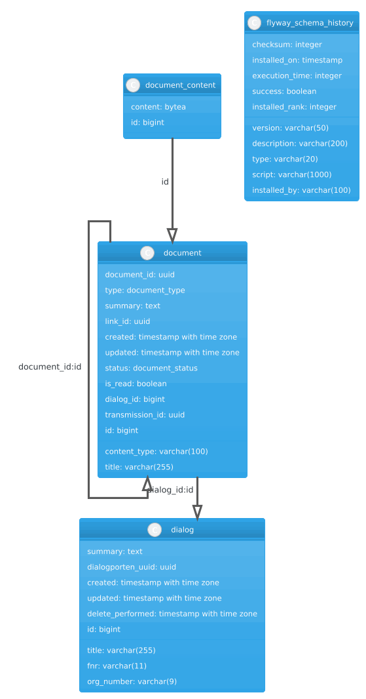

# Syfo-dokumentporten

This is the repository for Syfo-dokumentporten, a service that provides document storage and retrieval for followupplans and dialog meetings.
It will create dialogs in Altinn Dialogporten and add transmissions with links to documents stored in Dokumentporten,
so that external organizations can retrieve documents pertaining to their own employees, for archival purposes.
It requires authentication with a [Maskinporten token for a systemuser](https://samarbeid.digdir.no/altinn/systembruker/2542).

## Request flow from LPS perspective


## Database diagram


## Wiki
We have a [wiki](https://github.io/navikt/syfo-dokumentporten/wiki) for this project, 
with more detailed information about how external integrations partners can get started including how to set set up organizations from Test norge and test users with Dolly.

## OpenAPI
The OpenAPI specification for the API is available at https://syfo-dokumentporten.nav.no/swagger

To build or run the project, use one of the following tasks:

| Task                          | Description                                                          |
|-------------------------------|----------------------------------------------------------------------|
| `./gradlew test`              | Run the tests                                                        |
| `./gradlew build`             | Build everything                                                     |
| `buildFatJar`                 | Build an executable JAR of the server with all dependencies included |
| `buildImage`                  | Build the docker image to use with the fat JAR                       |
| `publishImageToLocalRegistry` | Publish the docker image locally                                     |

If the server starts successfully, you'll see the following output:

```
2024-12-04 14:32:45.584 [main] INFO  Application - Application started in 0.303 seconds.
2024-12-04 14:32:45.682 [main] INFO  Application - Responding at http://0.0.0.0:8080
```

## Running tasks with mise
We use [mise](https://mise.jdx.dev/) to simplify running common tasks.
To run a task, use the command
```bash
mise <task-name>
````

To get a list of available tasks, run
```bash
mise tasks
```

## Docker compose
We have a docker-compose.yml file to run a postgresql database, texas and a fake authserver.

Start it using
```bash
docker-compose \
  -f docker-compose.yml \
  up -d
```

Stop them all again
```bash
docker-compose \
  -f docker-compose.yml \
  down
```

## Authentication for dev

In order to get a token for consumer, you can use the following url:
https://tokenx-token-generator.intern.dev.nav.no/api/obo?aud=dev-gcp:team-esyfo:syfo-dokumentporten

Select "på høyt nivå" and give the ident of a user that has access the desired resource in altinn, like the Daglig
leder for the organisasjonsnummer you want to test with.
Altinn resources needed

In order to get an azuread token, use the following url:
Open this in your browser:
https://azure-token-generator.intern.dev.nav.no/api/m2m?aud=dev-gcp.team-esyfo.syfo-dokumentporten
Use a login from @trygdeetaten from Ida.
This will give you a token that can be used to make a request to internal/api/v1/documents
