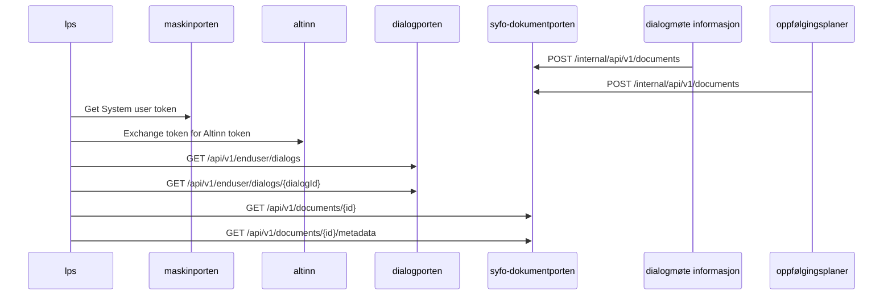
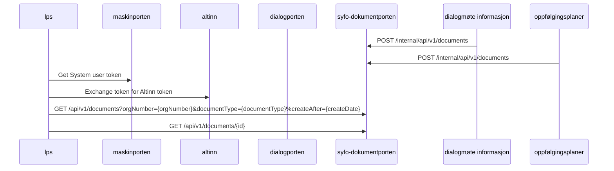
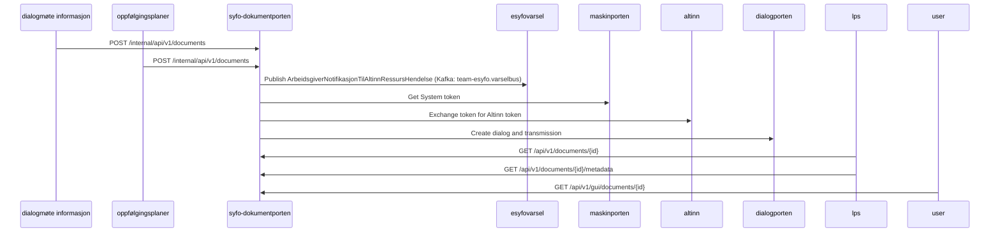
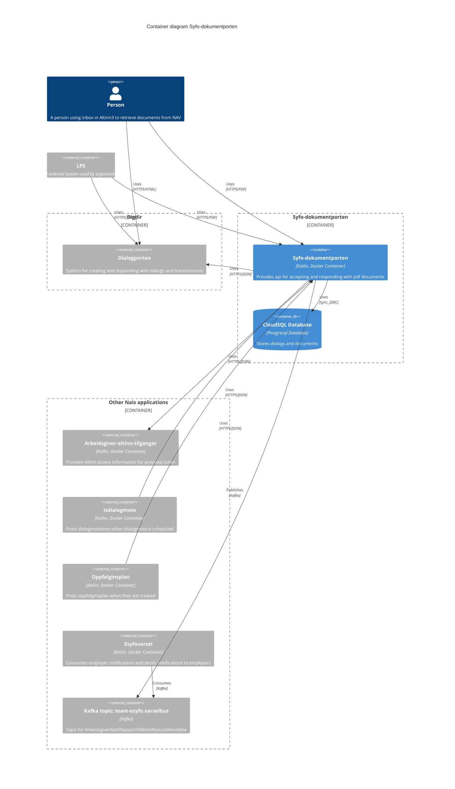

# Syfo-dokumentporten

[](https://github.com/navikt/syfo-dokumentporten/actions/workflows/build-and-deploy.yaml)

[](https://kotlinlang.org/)
[](https://ktor.io/)
[](https://www.postgresql.org/)

## Environments

[🚀 Productions internal](https://syfo-dokumentporten.intern.nav.no)

[🚀 Productions external](https://syfo-dokumentporten.nav.no)

[🛠️ Development internal](https://syfo-dokumentporten.intern.dev.nav.no)

[🛠️ Development external](https://syfo-dokumentporten.ekstern.dev.nav.no)


## OpenAPI
The OpenAPI specification for the API is available at https://syfo-dokumentporten.nav.no/swagger

## Overview
This is the repository for Syfo-dokumentporten, a service that provides document storage and retrieval for followupplans and dialog meetings.
It accepts documents from other NAV systems, and makes them available to external organizations through Altinn Dialogporten.

It will create dialogs in Altinn Dialogporten grouped by national identification number, and add transmissions with links back to its own endpoints.
This lets external organizations consume the dialogs and retrieve documents pertaining to their own employees, for archival purposes.

It requires authentication with a [Maskinporten token for a systemuser](https://samarbeid.digdir.no/altinn/systembruker/2542) for organizations to retrieve the documents.

## Document retention and cleanup

PDF content is retained for four **calendar months from storage**, using the persisted
`document.created` date in **UTC**, not the publication date. The document remains available
through that date plus four months; attachment `expiresAt` is midnight UTC on the following
day. For example, a document stored on `2026-06-01T10:00:00Z` expires on
`2026-10-02T00:00:00Z`: cleanup must not delete it on October 1. Calendar arithmetic clamps
short months: February 28, 2026 expires June 29, and October 31, 2025 expires March 1, 2026.

The shared `DocumentRetention` policy calculates both attachment expiry and the inverse
cleanup cutoff. The database predicate stays `created < cutoff AND content_deleted_at IS NULL`,
using the existing partial index on `(created, id)`. New-dialog and existing-dialog
transmissions use the same storage-based expiry; delayed publication and retries never extend it.
**Already-published remote Dialogporten expiry metadata is not rewritten by this change.**
Its links may therefore show a legacy expiry later than the actual local availability.

When `ENABLE_DOCUMENT_CLEANUP_JOB=true`, every replica runs cleanup immediately at startup,
then repeats after an hourly delay following each run. Each batch has at most **500 documents**;
a run stops at **1000 nonempty batches**, with a **100 ms delay** between full batches.
The transaction-scoped PostgreSQL advisory lock serializes **batches, not entire runs**.
A contending replica ends its run without waiting; row selection uses `FOR UPDATE SKIP LOCKED`.
The next scheduled run can continue a backlog, including rows skipped while locked.

Each batch atomically deletes `document_content`, soft-deletes the document using
`delete_performed` (preserving an existing timestamp), and sets `content_deleted_at`.
Missing content is tolerated and marked cleaned so it does not remain in the working set.
Document metadata remains stored, but soft-deleted documents are no longer returned by
normal document listings and authorized content/details requests return a controlled 404.
Authorization is still checked before reporting that a document is unavailable.
Logs and metrics report aggregate cutoff/batch/count/failure information, not PDF content
or person identifiers.

### Operations and failed V18 migration recovery

Deletion is irreversible through the cleanup feature. As an emergency stop, set
`ENABLE_DOCUMENT_CLEANUP_JOB=false` and redeploy all replicas. This stops future cleanup on
the replacement replicas; it does not restore content or undo already committed batches.
Old replicas may continue until stopped. Production disk, WAL and autovacuum capacity under
cleanup load has **not been verified** by the local regression tests; monitor capacity and
cleanup duration, failures, lock contention and capped runs during rollout.

V17 adds `content_deleted_at`; V18 recreates `idx_document_cleanup_pending` concurrently.
These migrations are already applied in dev and must not be edited. An interrupted
concurrent index build can leave an invalid index. A failed non-transactional V18 can also
leave a `success=false` entry in `flyway_schema_history`: even after removing the underlying
obstruction, the next migration attempt fails validation before V18 executes.

Recovery is a **manual, approved, environment- and schema-scoped operation**, never automatic
production repair:

1. Confirm the correct environment, database, schema, application artifact and migration
   locations using the approved operational access path. Coordinate replicas/migration
   runners so only the approved recovery runs. Do not retrieve documents or copy sensitive
   connection details, rows or logs into tickets or ordinary logs.
2. Inspect the intended schema's `flyway_schema_history` for version 18, success status and
   checksums. Inspect `pg_class`/`pg_namespace` and `pg_index` for the schema-qualified
   `idx_document_cleanup_pending`: object type, owning table, `indisvalid`, `indisready`,
   indexed columns `(created, id)` and predicate `content_deleted_at IS NULL`.
3. Identify and correct the actual failure. Remove an invalid index or conflicting
   non-index object only with approval and after confirming its ownership and impact.
   Use the verified schema-qualified name and the appropriate approved operation
   (`DROP INDEX CONCURRENTLY` must be outside a transaction). Do not drop a valid unrelated
   object merely because its name conflicts.
4. If a failed history entry remains, run explicit `Flyway.repair()` scoped to that same
   database/schema/history table with the **same approved migration artifacts, locations
   and configuration**. Review the repair's intended changes first: repair can affect
   history beyond V18. Do not delete migration-history rows manually, accept unexplained
   checksum changes, run broad repairs, or use repair as a substitute for fixing the cause.
5. Run migrate with the same configuration, or redeploy the approved artifact to run
   startup migrations. Verify successful V18 history and a valid, ready index on the
   correct table with the expected columns and partial predicate before resuming rollout.

`DocumentCleanupIndexMigrationTest` exercises both invalid-index recreation and a real
failed V18, validation rejection after removing the obstruction, explicit scoped repair,
and successful migration in an isolated test schema. This is recovery evidence, not proof
of production capacity or authorization to perform a production repair.


## Request flow from LPS perspective

```mermaid
sequenceDiagram
    participant lps
    participant maskinporten
    participant altinn
    participant dialogporten
    participant dokumentporten as syfo-dokumentporten
    participant dialogmote as dialogmøte informasjon
    participant oppfolginsplan as oppfølgingsplaner
    
    dialogmote ->> dokumentporten: POST /internal/api/v1/documents
    oppfolginsplan ->> dokumentporten: POST /internal/api/v1/documents
    lps ->> maskinporten: Get System user token
    lps ->> altinn: Exchange token for Altinn token
    lps ->> dialogporten: GET /api/v1/enduser/dialogs
    lps ->> dialogporten: GET /api/v1/enduser/dialogs/{dialogId}
    lps ->> dokumentporten: GET /api/v1/documents/{id}
    lps ->> dokumentporten: GET /api/v1/documents/{id}/metadata
```


### Alternatively, for LPS, using collection endpoint in syfo-dokumentporten to get details for documents
It is also possible for LPS to use the collection endpoint in syfo-dokumentporten to get details for documents added after a given timestamp, and then use one additional request per document to retrieve the PDF.
The collection endpoint must be called for each sub-entity(virksomhet) in the organization one wants to retrieve documents for.

```mermaid
sequenceDiagram
    participant lps
    participant maskinporten
    participant altinn
    participant dialogporten
    participant dokumentporten as syfo-dokumentporten
    participant dialogmote as dialogmøte informasjon
    participant oppfolginsplan as oppfølgingsplaner
    
    dialogmote ->> dokumentporten: POST /internal/api/v1/documents
    oppfolginsplan ->> dokumentporten: POST /internal/api/v1/documents
    lps ->> maskinporten: Get System user token
    lps ->> altinn: Exchange token for Altinn token
    lps ->> dokumentporten: GET /api/v1/documents?orgNumber={orgNumber}&documentType={documentType}%createAfter={createDate}
    lps ->> dokumentporten: GET /api/v1/documents/{id}
```

### Subscribing to Altinn Dialogporten for real time updates on dialogs and transmissions
If you want more dynamic updates of dialogs than possible with polling, you can subscribe to events from Altinn Dialogporten for updates on dialogs and transmissions.
Consult [event documentation](https://docs.altinn.studio/en/dialogporten/getting-started/events/) from Altinn Dialogporten for more information on how to do this.

## Request flow from Syfo-dokumentporten perspective

```mermaid
sequenceDiagram
    participant dialogmote as dialogmøte informasjon 
    participant oppfolginsplan as oppfølgingsplaner
    participant dokumentporten as syfo-dokumentporten
    participant esyfovarsel
    participant maskinporten
    participant altinn
    participant dialogporten
    participant lps
    participant user

    dialogmote ->> dokumentporten: POST /internal/api/v1/documents
    oppfolginsplan ->> dokumentporten: POST /internal/api/v1/documents
    dokumentporten ->> esyfovarsel: Publish ArbeidsgiverNotifikasjonTilAltinnRessursHendelse (Kafka: team-esyfo.varselbus)
    dokumentporten ->> maskinporten: Get System token
    dokumentporten ->> altinn: Exchange token for Altinn token
    dokumentporten ->> dialogporten: Create dialog and transmission
    lps ->> dokumentporten: GET /api/v1/documents/{id}
    lps ->> dokumentporten: GET /api/v1/documents/{id}/metadata
    user ->> dokumentporten: GET /api/v1/gui/documents/{id}
```

## C4 Container diagram

```mermaid
    C4Container
    title Container diagram Syfo-dokumentporten
    Person(person, Person, "A person using inbox in Altinn3 to retrieve documents from NAV")
    Container_Ext(lps, "LPS", "And external system used by organizations")

    Container_Boundary(c3, "Digdir") {
        Container_Ext(dialogporten, "Dialogporten", "", "System for creating and responding with dialogs and transmissions")
    }
        
    Container_Boundary(c1, "Syfo-dokumentporten") {
        Container(dokumentporten, "Syfo-dokumentporten", "Kotlin, Docker Container", "Provides api for accepting and responding with pdf documents")
        ContainerDb(database, "CloudSQL Database", "Postgresql Database", "Stores dialogs and documents")
    }

    Container_Boundary(c2, "Other Nais applications") {
        Container_Ext(tilganger, "Arbeidsgiver-altinn-tilganger", "Kotlin, Docker Container", "Provides Altinn access information for provided token")
        Container_Ext(isdialogmote, "Isdialogmote", "Kotlin, Docker Container", "Posts dialogmotebrev when dialogmote is scheduled")
        Container_Ext(oppfolginsplan, "Oppfolginsplan", "Kotlin, Docker Container", "Posts oppfolginsplan when they are created")
        Container_Ext(esyfovarsel, "Esyfovarsel", "Kotlin, Docker Container", "Consumes employer notifications and sends notifications to employers")
        Container_Ext(varselbus, "Kafka topic: team-esyfo.varselbus", "Kafka", "Topic for ArbeidsgiverNotifikasjonTilAltinnRessursHendelse")
    }

    Rel(dokumentporten, tilganger, "Uses", "HTTPS/JSON")
    Rel(dokumentporten, dialogporten, "Uses", "HTTPS/JSON")
    Rel(dokumentporten, database, "Uses", "sync, JDBC")
    Rel(dokumentporten, varselbus, "Publishes", "Kafka")
    Rel(esyfovarsel, varselbus, "Consumes", "Kafka")
    Rel(isdialogmote, dokumentporten, "Uses", "HTTPS/JSON")
    Rel(oppfolginsplan, dokumentporten, "Uses", "HTTPS/JSON")
    Rel(lps, dialogporten, "Uses", "HTTPS/JSON")
    Rel(lps, dokumentporten, "Uses", "HTTPS/PDF")
    Rel(person, dialogporten, "Uses", "HTTPS/HTML")
    Rel(person, dokumentporten, "Uses", "HTTPS/PDF")
```

## Wiki
We have a [wiki](https://github.com/navikt/syfo-dokumentporten/wiki) for this project, 
with more detailed information about how external integrations partners can get started including how to set set up organizations from Test norge and test users with Dolly.

## Kafka

### Produserer til
- **`team-esyfo.varselbus`** — Publiserer arbeidsgivernotifikasjoner til esyfovarsel
  - Meldingstype: `ArbeidsgiverNotifikasjonTilAltinnRessursHendelse`
  - Topic-eier: team-esyfo (esyfovarsel)

### Avhengigheter
- esyfovarsel må ha støtte for `AG_VARSEL_ALTINN_RESSURS` hendelsestype
- `eksternReferanseId` = dokumentets UUID, brukes for deduplisering downstream

## Running tasks with mise
We use [mise](https://mise.jdx.dev/) to simplify running common tasks.
To run a task, use the command
```bash
mise <task-name>
````

To get a list of available tasks, run
```bash
mise tasks
```

## Development setup. Running locally
We have a docker-compose.yml file to run a postgresql database, texas and a fake authserver locally.

There are start and stop tasks available through mise.

## Authentication against dev environment
You can get bearer tokes for testing against dev environment using the internal token generator services.

### TokenX using for a synthetic user
In order to get a token for consumer, you can use the following url:
https://tokenx-token-generator.intern.dev.nav.no/api/obo?aud=dev-gcp:team-esyfo:syfo-dokumentporten

Select "på høyt nivå" and give the ident of a user that has access to the desired resource in altinn, like the Daglig
leder, for the organization number you want to test with.

There is a mise task to help with this:
```bash
mise auth-obo
```

### AzureAD token for machine to machine communication
To get a token you can use interact with the internal enpoints, eg. as a veileder, open this url in your browser:
https://azure-token-generator.intern.dev.nav.no/api/m2m?aud=dev-gcp.team-esyfo.syfo-dokumentporten
Use a login from @trygdeetaten from Ida.
This will give you a token that can be used to make a request to internal/api/v1/documents

There is a mise task to help with this:
```bash
mise auth-m2m
```
