# Syfo-dokumentporten

[](https://github.com/navikt/syfo-dokumentporten/actions/workflows/build-and-deploy.yaml)

[](https://kotlinlang.org/)
[](https://ktor.io/)
[](https://www.postgresql.org/)

## Environments

[🚀 Productions internal](https://syfo-dokumentporten.intern.nav.no)

[🚀 Productions external](https://syfo-dokumentporten.nav.no)

[🛠️ Development internal](https://syfo-dokumentporten.intern.dev.nav.no)

[🛠️ Development external](https://syfo-dokumentporten.ekstern.dev.nav.no)


## OpenAPI
The OpenAPI specification for the API is available at https://syfo-dokumentporten.nav.no/swagger

## Overview
This is the repository for Syfo-dokumentporten, a service that provides document storage and retrieval for followupplans and dialog meetings.
It accepts documents from other NAV systems, and makes them available to external organizations through Altinn Dialogporten.

It will create dialogs in Altinn Dialogporten grouped by national identification number, and add transmissions with links back to its own endpoints.
This lets external organizations consume the dialogs and retrieve documents pertaining to their own employees, for archival purposes.

It requires authentication with a [Maskinporten token for a systemuser](https://samarbeid.digdir.no/altinn/systembruker/2542) for organizations to retrieve the documents.


## Request flow from LPS perspective

```mermaid
sequenceDiagram
    participant lps
    participant maskinporten
    participant altinn
    participant dialogporten
    participant dokumentporten as syfo-dokumentporten
    participant dialogmote as dialogmøte informasjon
    participant oppfolginsplan as oppfølgingsplaner
    
    dialogmote ->> dokumentporten: POST /internal/api/v1/documents
    oppfolginsplan ->> dokumentporten: POST /internal/api/v1/documents
    lps ->> maskinporten: Get System user token
    lps ->> altinn: Exchange token for Altinn token
    lps ->> dialogporten: GET /api/v1/enduser/dialogs
    lps ->> dialogporten: GET /api/v1/enduser/dialogs/{dialogId}
    lps ->> dokumentporten: GET /api/v1/documents/{id}
    lps ->> dokumentporten: GET /api/v1/documents/{id}/metadata
```


## Request flow from Syfo-dokumentporten perspective

```mermaid
sequenceDiagram
    participant dialogmote as dialogmøte informasjon 
    participant oppfolginsplan as oppfølgingsplaner
    participant dokumentporten as syfo-dokumentporten
    participant maskinporten
    participant altinn
    participant dialogporten
    participant lps
    participant user

    dialogmote ->> dokumentporten: POST /internal/api/v1/documents
    oppfolginsplan ->> dokumentporten: POST /internal/api/v1/documents
    dokumentporten ->> maskinporten: Get System token
    dokumentporten ->> altinn: Exchange token for Altinn token
    dokumentporten ->> dialogporten: Create dialog and transmission
    lps ->> dokumentporten: GET /api/v1/documents/{id}
    lps ->> dokumentporten: GET /api/v1/documents/{id}/metadata
    user ->> dokumentporten: GET /api/v1/gui/documents/{id}
```


## C4 Container diagram


## Wiki
We have a [wiki](https://github.io/navikt/syfo-dokumentporten/wiki) for this project, 
with more detailed information about how external integrations partners can get started including how to set set up organizations from Test norge and test users with Dolly.

## Running tasks with mise
We use [mise](https://mise.jdx.dev/) to simplify running common tasks.
To run a task, use the command
```bash
mise <task-name>
````

To get a list of available tasks, run
```bash
mise tasks
```

## Development setup. Running locally
We have a docker-compose.yml file to run a postgresql database, texas and a fake authserver locally.

There are start and stop tasks available through mise.

## Authentication against dev environment
You can get bearer tokes for testing against dev environment using the internal token generator services.

### TokenX using for a synthetic user
In order to get a token for consumer, you can use the following url:
https://tokenx-token-generator.intern.dev.nav.no/api/obo?aud=dev-gcp:team-esyfo:syfo-dokumentporten

Select "på høyt nivå" and give the ident of a user that has access to the desired resource in altinn, like the Daglig
leder, for the organization number you want to test with.

There is a mise task to help with this:
```bash
mise auth-obo
```

### AzureAD token for machine to machine communication
To get a token you can use interact with the internal enpoints, eg. as a veileder, open this url in your browser:
https://azure-token-generator.intern.dev.nav.no/api/m2m?aud=dev-gcp.team-esyfo.syfo-dokumentporten
Use a login from @trygdeetaten from Ida.
This will give you a token that can be used to make a request to internal/api/v1/documents

There is a mise task to help with this:
```bash
mise auth-m2m
```
