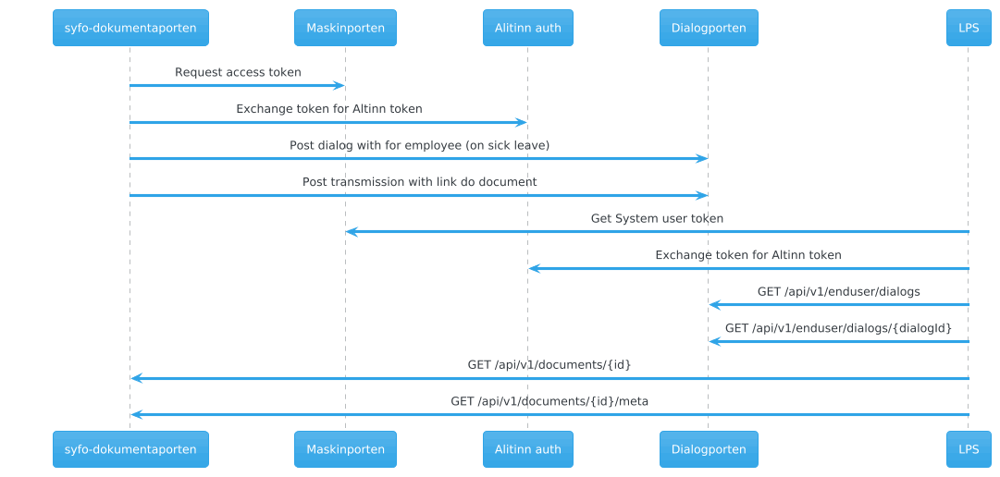

# Retrieve documents from Dokumentporten from LPS perspective
The Nav system will share the availability of documents for Dialog meetings and followup plans with organizations using [Dialogporten](https://samarbeid.digdir.no/altinn/dialogporten/2347).
It will create dialogs to group documents per employee, and add transmissions with links back the the api for retreating documents.

The dialogs can be viewed in the Altinn innboks, or fetched by other systems through Dialogporten api.
Dialogporten is a system delivered by Altinn. Check out their [documentation](https://docs.altinn.studio/nb/dialogporten/reference/openapi/) for more information.

Documentation for the api is available [here](https://syfo-dokumentporten.nav.no/swagger)
